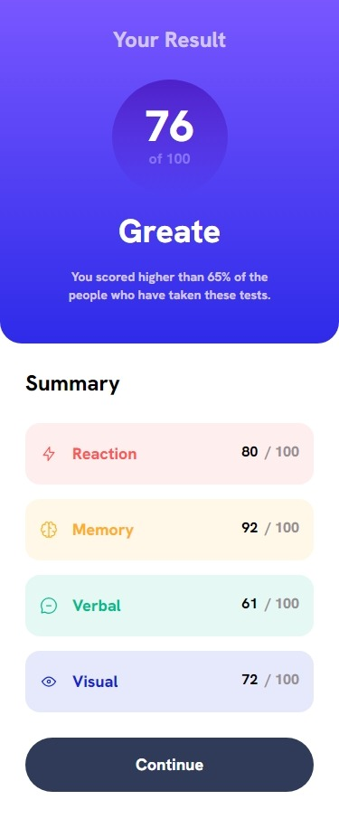
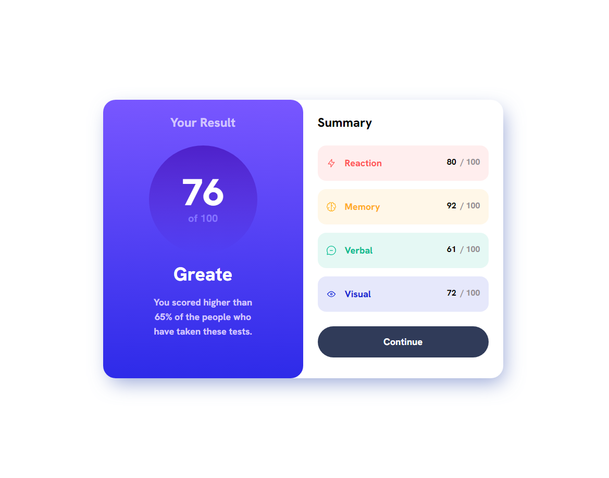

# Frontend Mentor - Results summary Component

## Table of contents

- [Overview](#overview)
  - [The challenge](#the-challenge)
  - [Screenshot](#screenshot)
  - [Links](#links)
- [My process](#my-process)
  - [Built with](#built-with)
  - [What I learned](#what-i-learned)
  - [Continued development](#continued-development)
- [Author](#author)

## Overview

### The challenge

Users should be able to:
- View the optimal layout for the interface depending on their device's screen size
- See hover and focus states for all interactive elements on the page
- Use the local JSON data to dynamically populate the content

### Screenshot

- Mobile:\
\

- Desktop:\
\

### Links

- Solution URL: [Results summary Component Solution](https://github.com/kietly2k/practiceprojects/tree/production/results-summary-component)
- Live Site URL: [Results summary Component Live Site](https://kietly2k.github.io/practiceprojects/results-summary-component/index.html)

## My process

### Built with

- Mobile-first workflow
- TailwindCSS
- ReactJS
- ViteJs

### What I learned

- How to use Tailwind CSS to create a simple Results summary Component.
- Handle responsive for all screen size using Tailwind CSS.
- Write components using ReactJS.
- Create and run project using Vite.
- Use prettier-plugin-tailwindcss to format code.

### Continued development

- Font weight of the paragraph quite large. Will fix it in the feature.

## Author

- Github: [Kiet Ly - Fullstack developer](https://github.com/kietly2k)
- Frontend Mentor: [kietly2k](https://www.frontendmentor.io/profile/kietly2k)